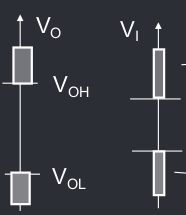
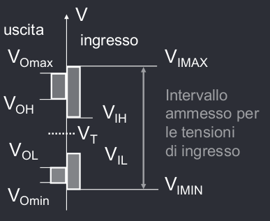
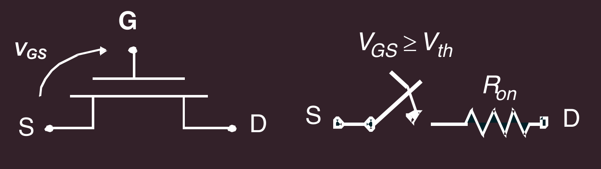
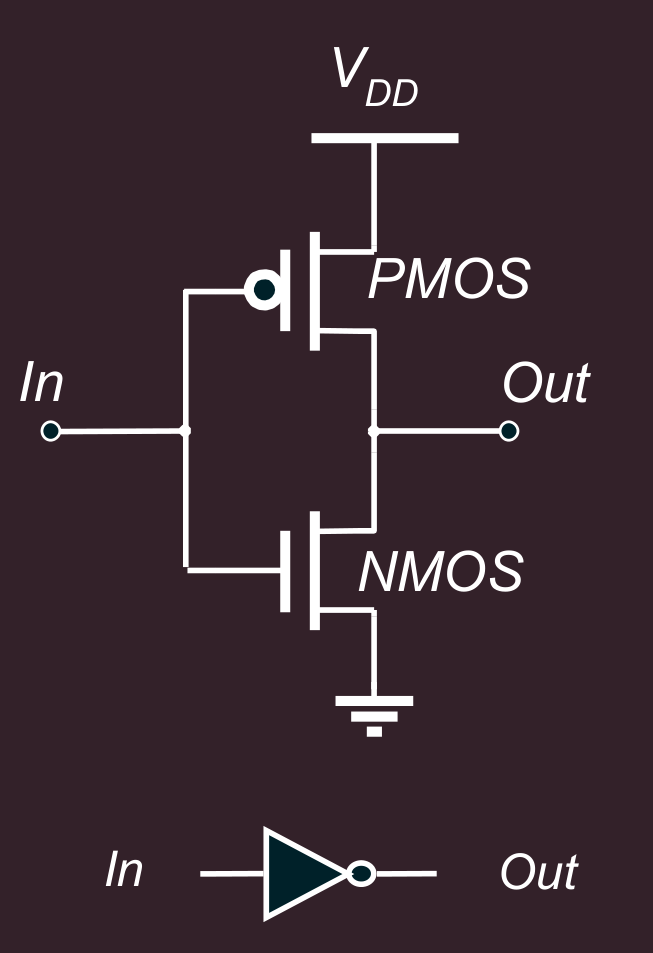

# Lezione B1
## Moduli digitali
I moduli digitali possono essere modellizzati da un blocco che ha n ingresssi, m uscite, un pin di alimentazione ed uno di ground. 

Per rappresentare gli stati logici si utilizzano tensione **alta** per l'1 logico e tensione **bassa** per lo 0 logico. Dunque $V_L$ ha una tensione di circa 0 Volt, mentre $V_H$ ha una tensione vicina alla tensione di alimentazione.

Si usa un range di valori che determinano valore iniziale e finale degli stati per ridurre il rumore.

Si può considerare come due soglie ed uno stato "cuscinetto" tra queste due soglie in cui il valore non è ben determinato.
Perché le porte funzionino correttamente è necessario che la tensione fornita in ingresso sia più grande della tensione di uscita.

Ovvero le ocndizioni di compatibilità sono:

- $V_{OL}$ < $V_{IL}$
- $V_{OH}$ > $V_{IH}$

La differenza $V_O - V_I$ definisce il margine di rumore:

- $NM_H = V_{OH} - V_{IH}$
- $NM_L = V_{OL} - V_{IL}$

## Struttura logica
Si può modellizare un modulo digitale in tre circuiti diversi:

- Circuito di ingresso, che verfifica lo stato logico dell'entrata
- Operatore logico, [...]
- Circuito d'uscita che generatensioni V esterne a $V_{OH}$ e $V_{OL}$.

## Dispositivi CMOS
I transistor MOS sono composti da tre morsetti: **drain**, **gate** e **source**.
Si può modellizzare il transistor come un interruttore in serie con una resistenza $R_{ON}$. Questa non è tuttavia lineare, ma varia all'aumentare di $V_{GS}.$

L'NMOS è attivo quando $V_{GS}$ è maggiore di $V_{TH}$, mentre il PMOS è attivo quando $V_{GS}$ è minore di $V_{TH}$. Questi due tipi sono perfettamente speculari e si utilizzano per creare gli intervalli di tensione descritti sopra tramite un CMOS.

Prendendo come esempio l'immagine sopra dell'inverter, quando $V_{GS} < V_{TH_P}$ l'uscita viene messa al ground, quando invece è maggiore di $V_{TH_N}$ l'uscite viene messa all'alimentazione, switchando quindi tra circa $V_{GND}$ a circa $V_{DD}$. Da notare che $V_{G} = - V_{IN}$ in quanto il dispositivo in questione è un inverter.

Quando si realizzano delle reti CMOS, queste sono formate dalla stessa funzione logica in pull-up (pMOS) collegata all'alimentazione ed in pull-down (nMOS) collegata al GND.

Per realizzare serie complesse il modo più semplice è realizzare prima la rete di pulldown con transistor in serie e/o parallelo e poi quella di pullup, sostituendo serie / parallelo.