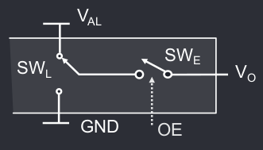
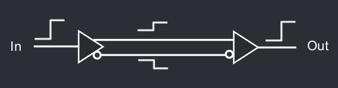

# Lezione B1
## Moduli digitali
I moduli digitali possono essere modellizzati da un blocco che ha n ingresssi, m uscite, un pin di alimentazione ed uno di ground. 

Per rappresentare gli stati logici si utilizzano tensione **alta** per l'1 logico e tensione **bassa** per lo 0 logico. Dunque $V_L$ ha una tensione di circa 0 Volt, mentre $V_H$ ha una tensione vicina alla tensione di alimentazione.

Si usa un range di valori che determinano valore iniziale e finale degli stati per ridurre il rumore.

Si può considerare come due soglie ed uno stato "cuscinetto" tra queste due soglie in cui il valore non è ben determinato.
Perché le porte funzionino correttamente è necessario che la tensione fornita in ingresso sia più grande della tensione di uscita.

Ovvero le ocndizioni di compatibilità sono:

- $V_{OL}$ < $V_{IL}$
- $V_{OH}$ > $V_{IH}$

La differenza $V_O - V_I$ definisce il margine di rumore:

- $NM_H = V_{OH} - V_{IH}$
- $NM_L = V_{OL} - V_{IL}$

## Struttura logica
Si può modellizare un modulo digitale in tre circuiti diversi:

- Circuito di ingresso, che verfifica lo stato logico dell'entrata
- Operatore logico, [...]
- Circuito d'uscita che generatensioni V esterne a $V_{OH}$ e $V_{OL}$.

## Dispositivi CMOS
I transistor MOS sono composti da tre morsetti: **drain**, **gate** e **source**.
Si può modellizzare il transistor come un interruttore in serie con una resistenza $R_{ON}$. Questa non è tuttavia lineare, ma varia all'aumentare di $V_{GS}.$

L'NMOS è attivo quando $V_{GS}$ è maggiore di $V_{TH}$, mentre il PMOS è attivo quando $V_{GS}$ è minore di $V_{TH}$. Questi due tipi sono perfettamente speculari e si utilizzano per creare gli intervalli di tensione descritti sopra tramite un CMOS.

Prendendo come esempio l'immagine sopra dell'inverter, quando $V_{GS} < V_{TH_P}$ l'uscita viene messa al ground, quando invece è maggiore di $V_{TH_N}$ l'uscite viene messa all'alimentazione, switchando quindi tra circa $V_{GND}$ a circa $V_{DD}$. Da notare che $V_{G} = - V_{IN}$ in quanto il dispositivo in questione è un inverter.

Quando si realizzano delle reti CMOS, queste sono formate dalla stessa funzione logica in pull-up (pMOS) collegata all'alimentazione ed in pull-down (nMOS) collegata al GND.

Per realizzare serie complesse il modo più semplice è realizzare prima la rete di pulldown con transistor in serie e/o parallelo e poi quella di pullup, sostituendo serie / parallelo.

# MOS
## Reistenza equivalente
I MOS hanno una resistenza equivalente che può essere diversa per lo stato alto e lo stato basso, definite $R_{OH}$ e $R_{OL}$.
La corrente che circola nell'uscita è dovuta agli ingressi $I_{IL}$ e $I_{IH}$ collegati all'uscita, che negli attuali circuiti MOS è praticamente nulla, ma bisogna comunque aggiungere delle condizioni di compatibilità delle correnti.

## Correnti di uscita

Definito $I_{OH}$ come il valore minimo necessario perché $V_O$ sia considerata 1 logico, prendiamo l'esempio del MOS in stato alto, $V_O = V_{AL} + R_{OH} \cdot I_O$. Per il corretto funzionamento $V_O > V_{OH}$ e quindi $R_L$ non può essere troppo piccola altrimenti la corrente $I_{OH}$ è troppo grande. Difatti per garantire $V_O > V_{OH}$ necessariamente $I_O > I_{OH}$.

Poi Definito $I_{OL} come il valore minimo necessario perché $V_O$ sia considerata 0 logico, per garantire $V_O < V_{OL}$ allora $I_O < I_{OL}$. Dato che $V_O = R_L \cdot I_O$, serve che $R_L$ sia abbastanza grande da garantirlo.
## Circuito Totem Pole
Il modello di MOS che abbiamo considerato fino ad ora è definito circuito totem pole.
## Circuito a tre stati
{ align=left }

Un circuito a tre stati ha uno stato alto, uno stato basso ed uno stato Z ad alta impedenza (spento).
Questo consente di creare moduli che si accendono e spengono in base all'Output Enable.

Per controllare questi Output Enable si utilizza un modulo di controllo chiamato Arbitro (OEi), che viene usato molto nei multiplexer e nella lettura di memorie e registri.

## Circuito Open Drain

Questo circuito ha due stati: GND (0 logico) o aperto. Si usa una resistenza di pull-up collegata all'alimentazione per avere lo stato HIGH ma questa non è collegata al MOS.

Quando il MOS è acceso l'uscita è bassa, quando è spento è alta.

Collegando in parallelo più circuiti open drain si possono ottenere funzioni logiche a basso costo.

## Parametri dinamici
## Ritardi
Tutti i modelli hanno dei tempi di commutazione (salita e discesa) non nulli, definiti come il tempo di variazione dal 10% al 90% della variazione. Ad esempio per un segnale che sale da 0V a 1V, $t_f$ sarà il tempo perché il segnale passi da 0.1V a 0.9V.

Inoltre le porte hanno tutti dei ritardi di propagazione, ovvero il tempo impiegato perché la commutazione dell'ingresso si propaghi all'uscita. Questo è definito come  il 50% della variazione, ovvero se si passa da 0V ad 1V sia su ingresso che su uscita, la distanza temporale tra quando l'ingresso è a 0.5V e l'uscita è a 0.5V.
Questo ritardo dipende dalle capacità intrinseche dei transistor che vengono modellizzate tramite una capacità equivalente $C_i$

Nelle strutture CMOS normalmente i tempi di salita e discesa sono confrontabili, molto simili, tranne nell'open drain in cui la resistenza di pull-up è molto grande, e quindi il ritardo di salita è molto più lungo rispetto al tempo di discesa.

## Pass Gate

Il pass gate è un MOS inserito in serie tra blocchi logici convenzionali.
Questo inserisce una resistenza $R_{ON}$ e una capacità $C_P$

TODO: cos'è un pass-gate?

## Segnali differenziali

Si invia lo stesso segnale tramite due collegamenti diversi. In una linea il segnale è inverso, per cui il ricevitore fa la differenza tra i due segnali e usa quello come segnale ricevuto.
Questo rende il segnale inviato immune ai disturbi dall'esterno e riduce il $\Delta V$ tra i segnali H ed L, aumentandone la velocità.

L'uso dei segnali differenziali è molto comune nelle interfacce seriali, in quanto richiedono meno transistor, sono più piccole e avendo tensioni di alimentazioni minori hanno disturbi e consumo minori.

## Potenza consumata

Per far funzionare i moduli gli si deve fornire energia che viene usata per il **funzionamento interno**, fornitura dei segnali **esterni** e una parte viene trasformata in **calore**. L'indicatore del **consumo** è la corrente assorbita dall'alimentazione, ovvero la ^^potenza^^ $P = VI$.

Una maggiore potenza richiede negli apparecchi fissi un peso / ingombro maggiore, in quelli portatili una riduzione dell'autonomia della batteria, oltre a disperdere maggior calore.

Nell'elettronica si considerano due tipi di potenza, la **potenza statica**, ovvero il consumo in assenza di commutazione, la quale è circa costante, e quella **dinamica**, ovvero il consumo quando si deve commutare di stato. Questa seconda è una corrente che carica e scarica un condensatore. 

Mentre la potenza statica si calcola come $P_S = V*I$, la potenza dinamica è uguale a $P_D = FCV^2$, dove F è il numero di volte al secondo in cui viene commutato lo stato e C è la capacità del condensatore.
La potenza dinamica si può quindi ridurre in tre modi:

- Riducendo la frequenza di commutazione F, il ché riduce però la velocità del circuito e il numero di operazioni al secondo.
- Riducendo la capacità C, il ché avviene man mano che la tecnologia progredisce.
- Riducendio $\Delta V$ tra stato alto e stato basso. L'effetto è quadratico, quindi in teoria questa sarebbe l'opzione migliore, ma ridurre troppo aumenta di molto il rumore.

Quindi in condizioni statiche $P_S = I_{off} \cdot V_{AL}$, mentre in condizioni dinamiche $P_S = FCV^2$; quello dinamico si può ridurre in fase di progetto, mentre nei circuiti più complessi e con più moduli quello statico è significativo.

TODO: esercizio slide 107

### Prodotto potenza per ritardo

In un circuito ideale sia la potenza dissipata che il ritardo sono nulli, mentre nei circuiti reali si deve cercare di renderli il più bassi possibile. In un circuito reale, la potenza dipende dalle capacità parassite di C e dalle correnti I di carica e scarica, mentre la prima dipende dall'evoluzione della tecnologia, la seconda la sceglie il progettista, tenendo presente che maggiore è I, maggiore e la velocità del circuito, ma anche il calore da dissipare. Per una data tecnologia, il prodotto potenza-ritardo è costante, tenendo conto che minore è questo prodotto, migliore è la tecnologia.

