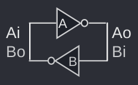
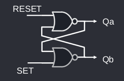

# Circuiti bistabili
I circuiti bistabili, anche detti flip flop, sono l'elemento base delle memorie.
## Anello di inverter

L'anello di inverter è il circuito bistabile più semplice.
## Flip-Flop SR

Il Flip-Flop Set-Reset ha due ingressi (S, R) e due uscite ($Q$, $\overline{Q}$)