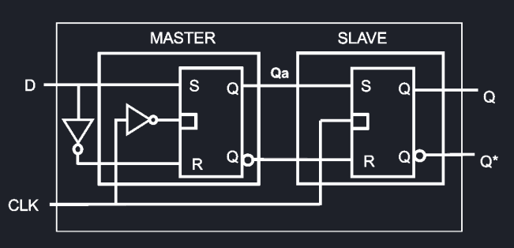

# Celle di memorizzazione
## Circuiti bistabili
I circuiti bistabili, anche detti flip flop, sono l'elemento base delle memorie.
Questi vengono usati per memorizzare bit, e ve ne sono diversi tipi, ognuno con un proprio costo.
## Anello di inverter

L'anello di inverter è il circuito bistabile più semplice.
Sono composti da un anello di inverter in cui l'uscita di 1 è uguale a $Q$, mentre l'uscita di 2 è uguale a $\overline{Q}$.
## Flip-Flop SR

Il Flip-Flop Set-Reset ha due ingressi (S, R) e due uscite ($Q$, $\overline{Q}$). L'ingresso SET imposta l'uscita $Q$ ad 1, mentre l'ingresso RESET imposta l'uscita $\overline{Q}$ ad 1.

Una condizione fondamentale di  questo flip-flop è che i due ingressi non devono essere attivi contemporaneamente, per non portare a condizioni di instabilità.

| SET | RESET | $Q$ | $\overline{Q}$ |
| - | - | - | - |
| 0 | 0 | $Q_{n-1}$ | $\overline{Q_{n-1}}$ |
| 0 | 1 | 0 | 1 |
| 1 | 0 | 1 | 0 |
| 1 | 1 | - | - |

## Latch D

Questo dispositivo elimina la restrizione dell'SR, usando un solo ingresso D che viene negato per fare in modo che S ed R non possano mai avere lo stesso valore.
Inoltre, alcune versioni di questo dispositivo contengono un ingresso LE di ENABLE.

| D | LE | $Q$ | $\overline{Q}$ |
| - | - | - | - |
| 0 | 0 | 0 | 0 |
| 1 | 0 | 0 | 0 |
| 0 | 1 | 0 | 1 |
| 1 | 1 | 1 | 0 |

Un lato negativo di questo dispositivo è che introduce più latenza rispetto al semplice SR.

Esiste anche una versione del latch D con due segnali PRESET e CLEAR, che agiscono indipendentemente da LE.

## Flip-Flop Master-Slave

Il Flip-Flop MS è un circuito sincrono che prevede due Latch-D in sequenza, in cui l'uscita del master è l'ingresso dello slave.
L'ENABLE dei FF è collegato ad un segnale di clock, ma il master ha si attiva su fronte di discesa, piuttosto che di salita.

Quello che succede, quindi, è che il master **campiona** gli ingressi quando il clock è ad HIGH e **commuta** (con memoria) quando è LOW.
Viceversa, lo slave campiona gli ingressi a LOW e commuta ad HIGH, quindi vi è sempre almeno mezzo ciclo di clock di ritardo tra quando l'ingresso viene inviato in D e quando viene commutata l'uscita Q.

Per fare in modo che l'uscita venga commutata ad HIGH, è necessario che D sia ad HIGH mentre il clock è LOW, nello specifico deve essere LOW nell'intorno sinistro del fronte di salita.

Esiste anche un Flip-Flop MS detto DDR (Double Data Rate) che memorizza ad ogni commutazione di clock, piuttosto che solo durante la LOW -> HIGH, e quindi agisc al doppio della velocità. Questa struttura viene usata molto nelle memorie RAM.

## Flip-Flop JK

Il Flip-Flop JK è simile all'SR, con la differenza che quando sia J che K sono HIGH (condizione precedentemente proibita) l'uscita commuta ad ogni colpo di clock.

| J | K | Q |   |
| - | - | - | - |
| 0 | 0 | $Q_{n-1}$ | memoria |
| 0 | 1 | 0 | RESET |
| 1 | 0 | 1 | SET |
| 1 | 1 | $\overline{Q_{n-1}}$ | TOGGLE |