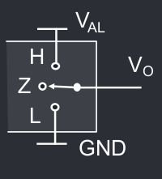

# MOS
## Reistenza equivalente
I MOS hanno una resistenza equivalente che può essere diversa per lo stato alto e lo stato basso, definite $R_{OH}$ e $R_{OL}$.
La corrente che circola nell'uscita è dovuta agli ingressi $I_{IL}$ e $I_{IH}$ collegati all'uscita, che negli attuali circuiti MOS è praticamente nulla, ma bisogna comunque aggiungere delle condizioni di compatibilità delle correnti.

## Correnti di uscita

Definito $I_{OH}$ come il valore minimo necessario perché $V_O$ sia considerata 1 logico, prendiamo l'esempio del MOS in stato alto, $V_O = V_{AL} + R_{OH} \cdot I_O$. Per il corretto funzionamento $V_O > V_{OH}$ e quindi $R_L$ non può essere troppo piccola altrimenti la corrente $I_{OH}$ è troppo grande. Difatti per garantire $V_O > V_{OH}$ necessariamente $I_O > I_{OH}$.

Poi Definito $I_{OL} come il valore minimo necessario perché $V_O$ sia considerata 0 logico, per garantire $V_O < V_{OL}$ allora $I_O < I_{OL}$. Dato che $V_O = R_L \cdot I_O$, serve che $R_L$ sia abbastanza grande da garantirlo.
## Circuito Totem Pole
Il modello di MOS che abbiamo considerato fino ad ora è definito circuito totem pole.
## Circuito a tre stati
{ align=left }

Un circuito a tre stati ha uno stato alto, uno stato basso ed uno stato Z ad alta impedenza (spento).
Questo consente di creare moduli che si accendono e spengono in base all'Output Enable.

Per controllare questi Output Enable si utilizza un modulo di controllo chiamato Arbitro (OEi), che viene usato molto nei multiplexer e nella lettura di memorie e registri.

## Circuito Open Drain

Questo circuito ha due stati: GND (0 logico) o aperto. Si usa una resistenza di pull-up collegata all'alimentazione per avere lo stato HIGH ma questa non è collegata al MOS.

Quando il MOS è acceso l'uscita è bassa, quando è spento è alta.

Collegando in parallelo più circuiti open drain si possono ottenere funzioni logiche a basso costo.

## Parametri dinamici
## Ritardi
Tutti i modelli hanno dei tempi di commutazione (salita e discesa) non nulli, definiti come il tempo di variazione dal 10% al 90% della variazione. Ad esempio per un segnale che sale da 0V a 1V, $t_f$ sarà il tempo perché il segnale passi da 0.1V a 0.9V.

Inoltre le porte hanno tutti dei ritardi di propagazione, ovvero il tempo impiegato perché la commutazione dell'ingresso si propaghi all'uscita. Questo è definito come  il 50% della variazione, ovvero se si passa da 0V ad 1V sia su ingresso che su uscita, la distanza temporale tra quando l'ingresso è a 0.5V e l'uscita è a 0.5V.
Questo ritardo dipende dalle capacità intrinseche dei transistor che vengono modellizzate tramite una capacità equivalente $C_i$

Nelle strutture CMOS normalmente i tempi di salita e discesa sono confrontabili, molto simili, tranne nell'open drain in cui la resistenza di pull-up è molto grande, e quindi il ritardo di salita è molto più lungo rispetto al tempo di discesa.

## Pass Gate

Il pass gate è un MOS inserito in serie tra blocchi logici convenzionali.
Questo inserisce una resistenza $R_{ON}$ e una capacità $C_P$

TODO: cos'è un pass-gate?

## Segnali differenziali

Si invia lo stesso segnale tramite due collegamenti diversi. In una linea il segnale è inverso, per cui il ricevitore fa la differenza tra i due segnali e usa quello come segnale ricevuto.