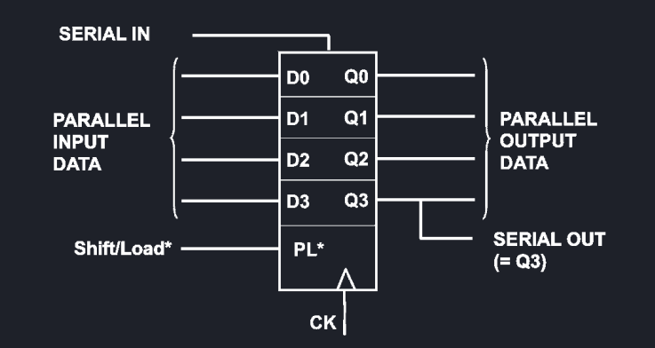

# Circuiti sequenziali
## Segnali seriali
I segnali seriali sono inviati tramite un singolo bus, cadenzato da un segnale di clock. Un segnale seriale è più lento rispetto ad uno parallelo, ma costa meno ed ha un consumo di potenza minore. Supponendo ad esempio un segnale ad 8 bit (una parola), servirebbero otto linee per mandare un segnale parallelo, mentre con il seriale se ne usa soltanto una.
## Registri
I dei dispositvi di memoria molto rapidi formati da una serie di flip-flop con comandi comuni. Questi possono avere ingressi e uscite seriali, o parallele, e si classificano in:

 - SISO (Serial-IN Serial-OUT)
 - SIPO (Serial-IN Parallel-OUT)
 - PISO (Parallel-IN Serial-OUT)
 - PIPO (Parallel-IN Parallel-OUT)

Esiste anche un tipo di registro chiamato SHIFT register, in quanto i Flip-Flop sono in sequenza e i dati vengno shiftati all'interno del registro, che ha quindi un solo ingresso ed una sola uscita, creando una struttura FIFO (First-IN First-OUT).

## Contatori e divisori
I **contatori** modulo N sono dei circuiti che ad ogni impulso di clock incrementano l'uscita Q un bit alla volta per mandare in output da 0 ad N. Questi possono essere sia sincroni (molto costosi ma con basso ritardo) che asincroni (poco costosi ma con un alto ritardo).

I **divisori di frequenza** modulo N sono dei circuiti simili ai contatori sequenziali, che permettono di dividere la frequenza del clock di N, dove n è il numero di flip-flop che realizzano il divisore.

Ad esempio, per un divisore con N = 2, il clock è collegato ad un flip-flop F1 in toggle, la cui uscita Q1 è impostata come clock di F2, sempre in toggle, la cui è uscita Q2 è il clock finale.

| CLK | D0 | **Q0** | D1 | **Q1** |
| --- | -- | -- | -- | -- |
| 0   | 0  | 0  | 0  | 0  |
| 1   | 1  | 1  | 1  | 1  |
| 0   | 1  | 1  | 1  | 1  |
| 1   | 0  | 0  | 1  | 1  |
| 0   | 0  | 0  | 1  | 1  |
| 1   | 1  | 1  | 0  | 0  |

Come si vede dalla tabella in alto, originariamente il clock varia tra HIGH e LOW ogni colpo di clock, il Flip-Flop 0 varia Q0 ogni due colpi di clock, il Flip-Flop 1 varia Q1 ogni quattro colpi di clock.

