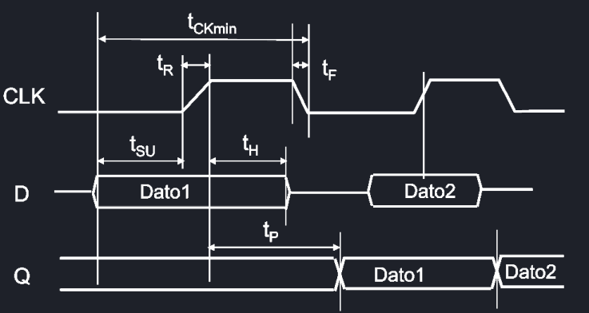

# Temporizzazione dei circuiti
## Temporizzazione delle porte logiche
Le porte logiche commutano dopo un tempo di propagazione $t_p$, ed è necessario rispettare alcuni parametri perché questo avvenga senza errori:

- $t_{SU}$, tempo *prima* del fronte di salita in cui il dato non deve cambiare;
- $t_H$, tempo  *dopo* del fronte di salita in cui il dato non deve cambiare;
- $t_R$, tempo trascorso durante il fronte di salita del clock;
- $t_F$, tempo trascorso durante il fronte di discesa del clock;

Il periodo minimo del clock è quindi la somma di questi valori $T_{clk_{min}} = t_{SU} + t_H + t_R + t_F$, e la frequenza massima del clock vale $f_{clk_{max}} = \frac{1}{T_{clk_{min}}}$

## Ritardi della logica combinatoria
Le logiche combinatorie dei circuiti influenzano la frequenza di funzionamento massima, e difatti si devono introdurre altri tre parametri di ritardo:

- $t_{CK - q}$, detto **ritardo clock-uscita**, ovvero il tempo trascorso tra quando arriva il colpo di clock e quando l'uscita Q si è stabilizzata;
- $t_{LCMIN}$, ritardo minimo di propagazione della logica combinatoria;
- $t_{LCMAX}$, ritardo massimo di propagazione della logica combinatoria;

Dunque si ricava che le condizioni da rispettare per calcolare il minimo periodo di clock sono:

$$\begin{cases}T_{CK} > t_{CK - q} + t_{LCMAX} + t_{SU}\\t_{CK_q}+t_{LCMIN} > t_H\end{cases}$$

Circuiti con tante strutture *ripple* (sequenziali) inducono più ritardi, ma costano poco, mentre circuiti con look-ahead (logica combinatoria a monte) costano di più ma hanno un ritardo inferiore.