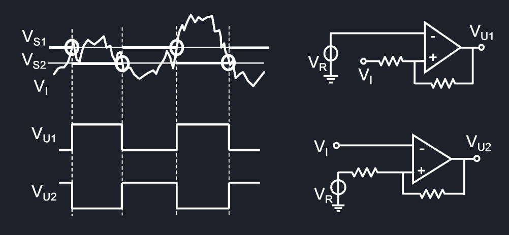
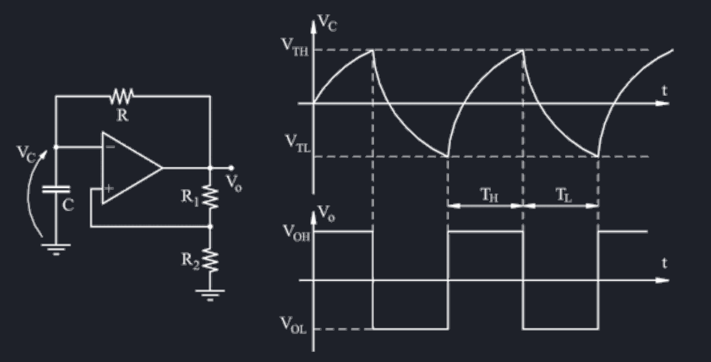
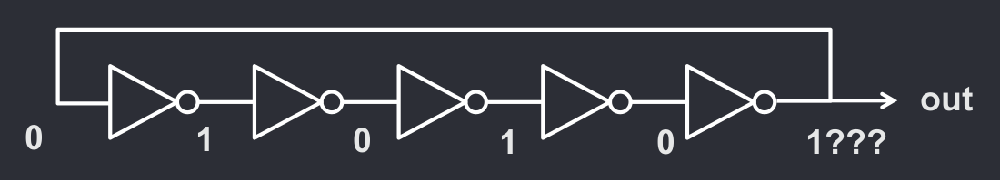
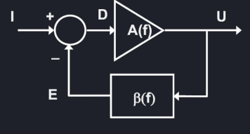
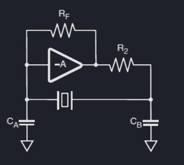

# Comparatori e oscillatori
## Comparatori
Il comparatore è un dispositivo in grado di tradurre un ingresso analgico in un'uscita binaria. Il comparatore più semplice usa una tensione $V_{T}$ e trasforma in HIGH tutte le tensioni $V > V_{T}$ e in LOW tutte le tensioni $V < V_{T}$, tuttavia, il rumore del segnale potrebbe portare a delle commutazioni ripetute non volute.

Dunque si usano spesso comparatori con isteresi ovvero comparatori a doppia soglia $V_{TH}$ e $V_{TL}$, con $V_{TL} < V_{TH}$. Quando l'ingresso supera una certa soglia, e viene commutato, per poter essere commutato nuovamente deve superare l'altra soglia, creando una regione "cuscinetto" tra le due soglie. Se ad esempio $V_I$ supera $V_{TH}$ e viene commutato in HIGH, dovrà poi scendere sotto $V_{TL}$ per essere commutato in LOW.

Questa doppia soglia è anche detta "**trigger di Shmitt**", e può essere usato in congiunzione con una rete RC per creare un generatore di onde quadre. 

## Oscillatori
Gli oscillatori sono dei dispositivi che si possono usare per generare diverse forme d'onda di ampiezza e frequenza varia, senza alcun segnale d'ingresso. Difatti, questi apparecchi vengono usati per *generare* segnali d'ingresso.
### Oscillatore ad inverter

L'oscillatore più semplice è quello formato da un numero N **dispari** di inverter in sequenza. 

Questo inverter può creare solo onde quadre di periodo $T = N(t_{pdLH} + t_{pdHL})$, tuttavia,comprensibilmente e il periodo dell'onda dipende dai tempi di propagazione delle porte logiche.
Questi tempi variano in base all'alimentazione, alla temperatura esterna e alla tolleranza di fabbricazione, dunque non è un oscillatore molto stabile.
### Oscillatore con reazione

Questo tipo di oscillatore è realizzato tramite un sistema in retroazione, che secondo il **criterio di Barkhausen**[^1] può autosostenersi anche senza alcun ingresso.

Questo genera un segnale $U(f) = \frac{A(f)}{1 + A(f)B(f)}I(f)$, dove in genere $A(f) = A_0$ è costante e rappresenta il guadagno dell'amplificatore.

[^1]: Se $A(f)\beta(f) = -1$, il sistema lineare elettronico può autosostenersi con retroazione positiva.

Il guadagno della rete di reazione invece è implementato solitamente con **reti RC**, **reti LC** o **cristalli piezoelettrici**.

### Oscillatore di Pierce al quarzo
Il quarzo è un materiale **piezoelettrico**, ovvero:

 - Si deforma in presenza di un campo elettrico;
 - Genera tensione se sottoposto a sollecitazioni meccaniche;
 - Risuona con basse perdite ad alta precisione.

### Phase-Locked Loop
La frequenza massima dell'oscillatore al quarzo è di circa 200MHz

TODO: finisci PLL