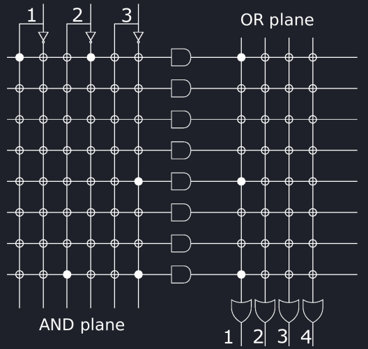
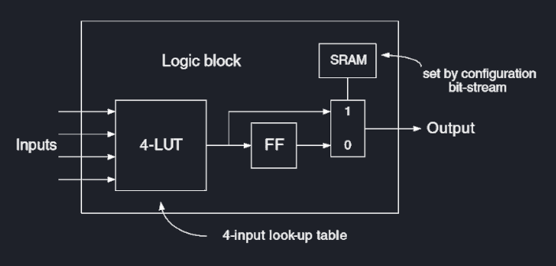
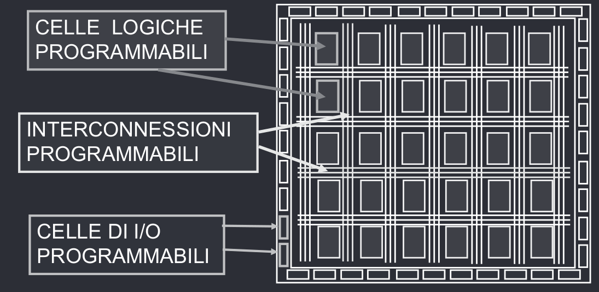

# Logiche Programmabili
Un dispositivo logico programmabile è un circuito integrato che non ha una funzione specifica in fase di fabbricazione, ma l'utente finale che lo usa nei suoi sistemi elettronici può programmarne l'uso.
## PLA
I **Programmable Logic Array** sono dei dispositivi composti da una matrice di porte NOR, AND ed OR programmabili. Dato che (N, A, O) realizza un set completo, è possibile usare i PLA per creare qualsiasi funzione logica, data un numero massimo di ingressi ed uscite.

## FPGA

I **Field Programmable Gate Array** sono dei dispositivi hardware formati da un circuito integrato che consente di programmare e modificare la funzionalità logica tramite linguaggi di descrizione hardware.

Sviluppare una FPGA richiede molto tempo, ma essendo i circuiti dedicati ad una singola funzione specifica, sono molto più veloci di una CPU che deve eseguire funzioni generiche.