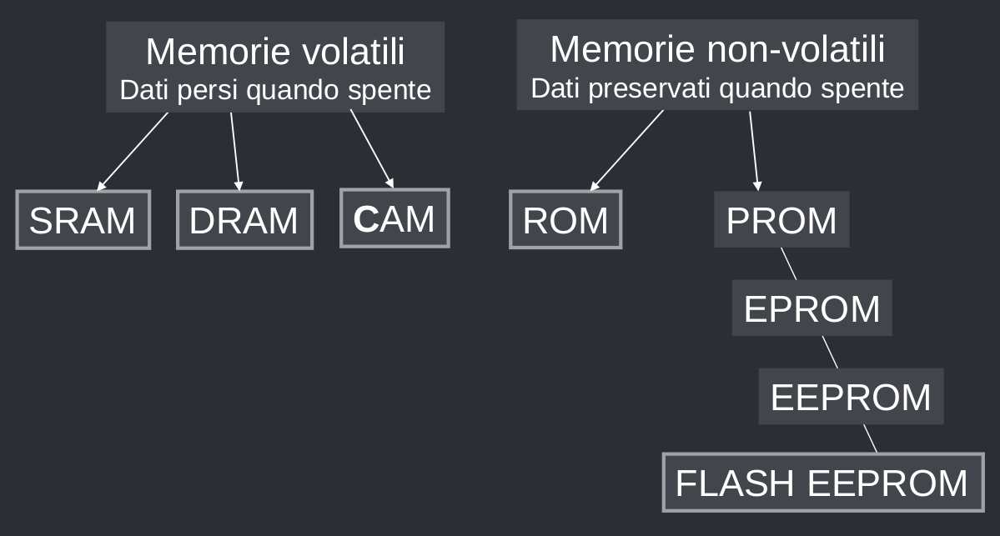
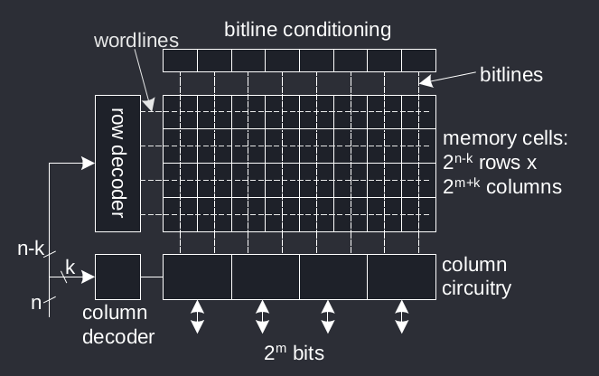

# Memorie a semiconduttore
Le memorie a semiconduttore  si possono classificare secondo la seguente tabella:

## Matrice di memoria
Le memorie sono costruite seguendo un'architettura matriciale per scalabilità e regolarità. Ogni cella è formata da $2^n$ word di $2^m$ bit l'una. Se n è molto maggiore di m, la matrice risulta sbilanciata, e quindi si divide in $2^k$ blocchi. Ogni riga contiene un blocco, ed un blocco contiene più parole.

Quindi quando si vuole selezionare una parola, il decoder della riga seleziona il blocco in cui è contenuta la parola, e il decoder della colonna seleziona l'indice della parola nella riga.
## DRAM
La **Dynamic RAM** è chiamata *dynamic* in quanto lo storage è composto da un condensatore che nel tempo perde la carica, per cui ha bisogno di cicli di refresh per mantenere le informazioni memorizzate.

La cella DRAM fondamentale prevede un transistor solo, che collega la bitline allo storage quando la **w**ord**l**ine è attiva.

In scrittura, il dato da memorizzare è passato tramite la bitline che avrà un valore HIGH o LOW, e quando viene attivata la wordline il valore viene trasferito alla cella $C_S$.

In lettura invece, dapprima si portano la bitline a $\frac{V_{DD}}{2}$ e la worldline a $V_{DD}$, per fare entrare il transistor in conduzione. A questo punto il valore di $C_S$ viene trasferito a $C_{BL}$, quindi $C_S$ perde per un momento il valore memorizzato in memoria, che viene però subito amplificato dal *sense amplifier* e riscritto in $C_S$.

A questo punto, periodicamente viene eseguito il **refresh** di tutte le celle per mantenere in memoria il valore. Il comportamento del refresh non è altro che una finta lettura, operato su tutte le celle.

Le operazioni possono avvenire in maniera **asincrona**, tramite i segnali *Row Address Strobe*, *Column Address Strobe*, *Write Enable* e *Output Enable*, o **sincrona**, in cui le operazioni avvengono ogni battito di clock. Se le operazioni avvengono su entrambi i fronti del clock si parla di *Double Data Rate*.

### Temporizzazione DRAM

I parametri fondamentali delle tempistiche delle DRAM sono:

| Param | Spiegazione |
| - | - |
| $t_{RAC}$ | Ritardo minimo tra RAS e dati validi in uscita |
| $t_{RC}$ | Distanza minima tra una trasizione H -> L -> H di RAS |
| $t_{CAC}$ | Ritardo minimo tra CAS e dati validi in uscita |
| $t_{PC}$ | Distanza minima tra una transizione H -> L -> H di CAS |
| $CL$ | La CAS Latency è la distanza, in cicli di clock, tra il campionamento del comando di READ e la disponibilità in uscita di un dato. |

## SRAM
La **Static RAM** è una memoria volatile che non ha bisogno di refresh, in quanto non è composta da condensatori, ma solo da sei transistor.

In scrittura, $BL$ viene forzato al valore desiderato, e $\overline{BL}$ al complementare, e la riga viene selezionata tramite $WL = 1$.

In lettura, $BL$, $\overline{BL}$ e $WL$ vengono forzati a $V_{DD}$ (HIGH) e la variazione di potenziale di $BL$ e $\overline{BL}$ viene amplificata dal sense amplifier che viene trasmessa.

La SRAM è molto costosa da realizzare ed è molto grande, dunque ha una densità di memorizzazione minore della SRAM, tuttavia è più veloce delle SRAM in quanto non richiede refresh ed ha una lettura non-distruttiva.
## CAM
La **Content Addressable Memory** è un tipo di memoria volatile che realizza una memoria associativa, ovvero riceve in input un dato specifico e contiene l'indirizzo in memoria del dato.

Le CAM sono molto veloci e vengono usate per realizzare routing table e cache.
## ROM
## MPROM
Le **Mask Programmable Read Only Memory** sono delle memorie non volatili che normalmente vengono programmate durante la realizzazione, ma non sono riprogrammabili. Ad esempio, venivano utilizzate per i vecchi BIOS (quando ancora non si potevano aggiornare). Questo perché le connessioni sono realizzate fisicamente tramite un livello di maschera.
## EPROM
La **Erasable Programmable Read  Only Memory** è una memoria non volatile che può essere riprogrammata tramite un trattamento a raggi UV, un numero limitato di volte.

Hanno una lettura molto veloce ma una scrittura lenta, in quanto richiede la cancellazione dell'intera cella di memoria.
## EEPROM
La **Electrically Erasable Programmable Read Only Memory** è una memoria non volatile che può essere riprogrammata elettricamente.
## FLASH
## NAND FLASH
