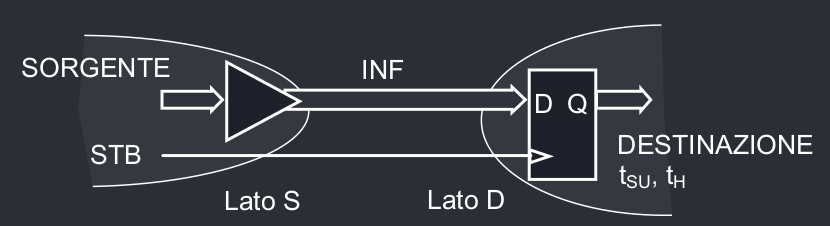
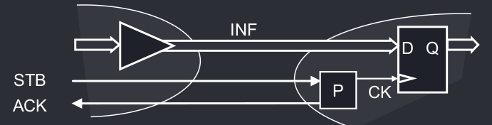
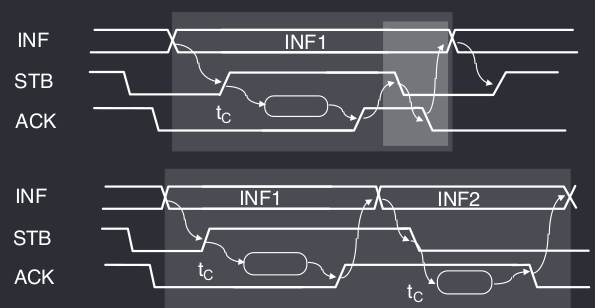

# Bus e Interconnessioni
Sebbene i chip ora abbiano miliardi di transistor, il vero bottleneck dell'informatica è la distribuzione di segnali ed energia attraverso i chip.

Viene definito **driver** la parte che invia il segnale, e **receiver** la parte che lo riceve e *idealmente* queste due parti dovrebbero essere equipotenziali.
## Linea di trasmissione
Una linea di trasmissione è definita con parametri elettrici e fisici, quali:

| Parametro | Spiegazione | Espressione |
| - | - | - |
| $Z_\infty$ | Impedenza caratteristica | $Z_\infty = \sqrt{\frac{L_U}{C_U}}$ |
| $L$ | Lunghezza | |
| $v_p$ | Velocità di propagazione dealt textl segnale | $v_p = \frac{1}{\sqrt{L_U \cdot C_U}}$ |
| $t_p$ | Tempo di propagazione del segnale | $t_p = \frac{L}{v_P}$ |
| $L_U$ | Induttanza per una lunghezza unitaria | | 
| $C_U$ | Capacità per una lunghezza unitaria | |

## Riflessioni
Per inviare il segnale, il driver, alimentato con una tensione $V_A$ genera un gradino da 0 a $V_A$, ma fa uscire un segnale pari a $V_B(0) = \frac{Z_\infty}{R_0 + Z_\infty}V_A$, dove $R_0$ è la resistenza di uscita del driver.

Questo segnale, quando ricevuto dal receiver viene assorbito completamente se il receiver ha una resistenza d'ingresso pari alla $Z_\infty$, altrimenti viene generata un'**onda riflessa** che si muove verso il driver.

Questo **indice di riflessione** può essere calcolato come $\Gamma_T = \frac{R_T - Z_\infty}{R_T + Z_\infty}$, con ampiezza dell'onda riflessa pari a $V_R = \Gamma_T V_B$

- Quando $R_T - Z_\infty = 0$, $\Gamma _T = 0$ e la linea viene detta *linea chiusa*; in questo caso non viene generata alcuna onda riflessa.
- Se $R_T \to \infty$, la linea viene detta *aperta*, e $\Gamma_T = 1$; in questo caso viene generata un'onda riflessa di ampiezza uguale a quella riflessa, ma con tensione alla terminazione raddoppiata.
- Se $R_T = 0$, $\Gamma_T = -1$ e l'onda riflessa ha una tensione uguale e opposta a quella incidente, quindi la tensione alla terminazione è nulla.

## Temporizzazione
Le interconnessioni sono caratterizzate da due principali parametri temporali:

| Parametro | Spiegazione|
| - | - |
| $t_{TX}$ | Tempo di trasmissione, ovvero il ritardo con cui il receiver rileva la variazione di stato logico (diverso da $t_p$ ritardo di propagazione). |
| $t_K$ | Tempo di skew, ovvero l'intervallo temporale definito come $t_k = t_{TX_{MAX}} - t_{TX_{MIN}}$. | 

## Commutazione IWS e RWS
Il ricevitore deve scegliere se analizzare la commutazione del segnale incidente o riflesso, e per realizzare questa funzione si analizza il **primo gradino**, ovvero la transizione impressa dal driver che genera un'onda incidente.

La sua ampiezza dipende da $R_0$ e $Z_\infty$, e si possono verificare tre casi:

|  | Spiegazione | Tempo di tramissione | Consumo energetico | $t_{TX_{MAX}}$ | $t_K$ |
| - | - | - | - | - | - |
| $R_0 < Z_\infty$ | In questo caso la tensione del primo gradino è *ampia*, e quindi è possibile usare l'**Incident Wave Switching**, analizzando quindi il segnale incidente | Basso | Alto | $t_p$ | $t_p$ |
| $R_0 = Z_\infty$ | In questo caso di **driver adattato** si usa il **Reflected Wave Switching**, sebbene essendo $\Gamma_T = 0$ l'onda riflessa dura molto poco e non arriva al driver | Bilanciato | Basso | $2t_p$ | $2t_P$ |
| $R_ 0 > >_\infty$ | In questo caso il primo gradino ha una tensione bassa e $\Gamma_T > 0$; il segnale verra riflesso diverse volte prima di avere una tensione tale da poter essere commutato tramite RWS. | Alto | - | $N \cdot 2t_p$ | - | 

## Cicli di trasferimento
I cicli di trasferimento sono dei protocolli che vengono usati per garantire il corretto trasferimento delle informazioni.
Si possono usare due protocolli di temporizzazione: **fissa o sincrona** o **adattiva o asincrona**.

Una tramissione ha due tipi di operazioni, la *lettura*, richiesta dal receiver, e la *scrittura* richiesta dal driver.

In entrabi i casi si utilizza un segnale STB di strobe che indica che il dato è stato inviato sul canale di comunicazione ed è pronto per essere letto. 
### Ciclo Sincrono

Il protocollo sincrono fa in modo da rispettare le specifiche worst-case per ogni operazione, e si usano dei **ritardi fissi** che permettono di garantire la ricezione corretta dei dati.

Tutti i parametri di temporizzazione sono controllati dal driver con due tempi $t_a$ e $t_b$. Esaminando la scrittura sincrona, si ha che:

1. Il driver invia il bit da scrivere
2. Aspetta un tempo $t_a$ **fisso** determinato come $t_a > t_{SU} + t_k$, in modo tale da rispettare il tempo di setup del segnale.
3. Invia il segnale STB (Strobe Input) che viene usato come clock dal registro di destinazione.
4. Aspetta un tempo $t_b$ **fisso** determinato come $t_b > t_H + t_k$[^1], in modo tale da rispettare il tempo di hold del segnale.

[^1]: Il tempo di skew $t_k$ si può considerare come una sorta di "tempo di errore" da attendere perché $t_{SU}$ o $t_H$ vadano a termine. Di fatto la domanda che si sta chiedendo in questo caso è: "Considerando il tempo di skew, quanto tempo è passato da quando il dato è stato inviato dal driver, e ricevuto dal receiver [per un tempo di $t_{SU}$] / [che ha commutato lo stato per un tempo $t_H$]? 

Si ricava quindi che la durata minima del ciclo sincrono è $t_C = t_a + t_b$ $= t_{SU} + t_H + 2\cdot t_K$.
### Ciclo Asincrono

Il ciclo asincrono utilizza un segnale di controllo chiamato ACK (Acknowledgment detto anche *handshake*), che può essere inviato da entrambe le parti per ricevere conferma di ricezione. In questo tipo di protocollo al driver basta conoscere $t_k$ per garantire l'invio corretto dei dati.

La sequenza di operazioni elementari è quindi:

1. Invio del bit da scrivere sul bus.
2. Attesa del tempo di skew $t_k$ per garantire che venga rispettato il tempo di setup $t_{SU}$ al receiver.
3. Invio del comando di strobe STB.
4. Attesa del segnale di ACK da parte del receiver.

Dunque nei cicli asincroni si ricava che $t_{C_{MIN}} = T_{SU} + T_H + T_K + 4\cdot t_{TX_{MAX}}$. Chiaramente questo ciclo è molto più rapido in quanto la tempistica si adatta alla velocità della destinazione.

## Protocollo Source Synchronous
Il protocollo che porta le prestazioni migliori è il **source synchronous**, in cui il verso di lettura e scrittura è sempre lo stesso, e viene definito *master* il driver e *slave* il receiver.

In questo caso la temporizzazione è data dalla sola latenza della trasmissione e dello skew, ma la durata di un ciclo dipende solo da $t_C = t_k$, in quanto il tempo di skew include il tempo di tramissione.

## Double Data Rate
Si possono usare i protocolli in versione DDR sfruttando entrambe le transizioni dei segnali di comando STB e ACK, il ché porta d una maggior velocità e un minor consumo, ma la circuiteria che controlla il DDR è più complessa della circuiteria classica.

## Prestazioni di un Bus
Le prestazioni di un bus si indicano tramite il **throughput**, ovvero la quantità di informazioni trasferita nel tempo: $T = BW \cdot S$, dove BW è la larghezza di banda, mentre S è la velocità del bus indicata in cicli al secondo $S = 1 / t_C$.

Il protocollo con le prestazioni più alte è il Source Synchronous con Double Data Rate.