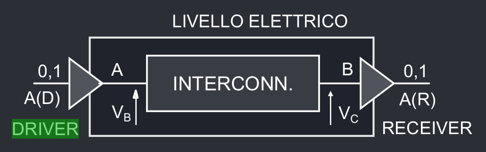
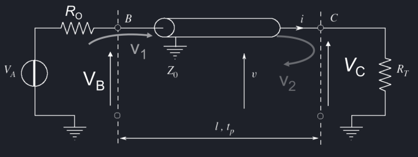

# Bus e Interconnessioni
Sebbene i chip ora abbiano miliardi di transistor, il vero bottleneck dell'informatica è la distribuzione di segnali ed energia attraverso i chip.

Viene definito **driver** la parte che invia il segnale, e **receiver** la parte che lo riceve e *idealmente* queste due parti dovrebbero essere equipotenziali.
## Linea di trasmissione
Una linea di trasmissione è definita con parametri elettrici e fisici, quali:

| Parametro | Spiegazione | Espressione |
| - | - | - |
| $Z_\infty$ | Impedenza caratteristica | $Z_\infty = \sqrt{\frac{L_U}{C_U}}$ |
| $L$ | Lunghezza | |
| $v_p$ | Velocità di propagazione dealt textl segnale | $v_p = \frac{1}{\sqrt{L_U \cdot C_U}}$ |
| $t_p$ | Tempo di propagazione del segnale | $t_p = \frac{L}{v_P}$ |
| $L_U$ | Induttanza per una lunghezza unitaria | | 
| $C_U$ | Capacità per una lunghezza unitaria | |

## Riflessioni
Per inviare il segnale, il driver, alimentato con una tensione $V_A$ genera un gradino da 0 a $V_A$, ma fa uscire un segnale pari a $V_B(0) = \frac{Z_\infty}{R_0 + Z_\infty}V_A$, dove $R_0$ è la resistenza di uscita del driver.

Questo segnale, quando ricevuto dal receiver viene assorbito completamente se il receiver ha una resistenza d'ingresso pari alla $Z_\infty$, altrimenti viene generata un'**onda riflessa** che si muove verso il driver.

Questo **indice di riflessione** può essere calcolato come $\Gamma_T = \frac{R_T - Z_\infty}{R_T + Z_\infty}$, con ampiezza dell'onda riflessa pari a $V_R = \Gamma_T V_B$

- Quando $R_T - Z_\infty = 0$, $\Gamma _T = 0$ e la linea viene detta *linea chiusa*; in questo caso non viene generata alcuna onda riflessa.
- Se $R_T \to \infty$, la linea viene detta *aperta*, e $\Gamma_T = 1$; in questo caso viene generata un'onda riflessa di ampiezza uguale a quella riflessa, ma con tensione alla terminazione raddoppiata.
- Se $R_T = 0$, $\Gamma_T = -1$ e l'onda riflessa ha una tensione uguale e opposta a quella incidente, quindi la tensione alla terminazione è nulla.

## Temporizzazione
Le interconnessioni sono caratterizzate da due principali parametri temporali:

| Parametro | Spiegazione|
| - | - |
| $t_{TX}$ | Tempo di trasmissione, ovvero il ritardo con cui il receiver rileva la variazione di stato logico (diverso da $t_p$ ritardo di propagazione). |
| $t_K$ | Tempo di skew, ovvero l'intervallo temporale definito come $t_k = t_{TX_{MAX}} - t_{TX_{MIN}}$. | 

## Commutazione IWS e RWS
Il ricevitore deve scegliere se analizzare la commutazione del segnale incidente o riflesso, e per realizzare questa funzione si analizza il **primo gradino**, ovvero la transizione impressa dal driver che genera un'onda incidente.

La sua ampiezza dipende da $R_0$ e $Z_\infty$, e si possono verificare tre casi:

|  | Spiegazione | Tempo di tramissione | Consumo energetico | $t_{TX_{MAX}}$ | $t_K$ |
| - | - | - | - | - | - |
| $R_0 < Z_\infty$ | In questo caso la tensione del primo gradino è *ampia*, e quindi è possibile usare l'**Incident Wave Switching**, analizzando quindi il segnale incidente | Basso | Alto | $t_p$ | $t_p$ |
| $R_0 = Z_\infty$ | In questo caso di **driver adattato** si usa il **Reflected Wave Switching**, sebbene essendo $\Gamma_T = 0$ l'onda riflessa dura molto poco e non arriva al driver | Bilanciato | Basso | $2t_p$ | $2t_P$ |
| $R_ 0 > >_\infty$ | In questo caso il primo gradino ha una tensione bassa e $\Gamma_T > 0$; il segnale verra riflesso diverse volte prima di avere una tensione tale da poter essere commutato tramite RWS. | Alto | - | $N \cdot 2t_p$ | - | 

## Cicli di trasferimento
### Ciclo Sincrono
### Ciclo Asincrono
## Prestazioni di un Bus