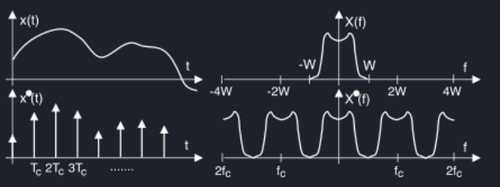
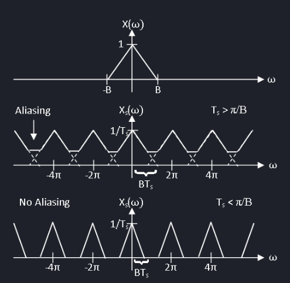

# Sistemi di conversione
I sistemi di conversione vengono usati per ottenere dei dati digitali a partire da dati analogici, o ottenere dati analogici a partire da dati digitali. In natura non esistono dati digitali, che però sono più facili da elaborare tramite un calcolatore, per cui sono molto più comuni i convertitori analogico / digitale.

Per passare da un segnale analogico ad uno digitale si effettuano due passaggi, **campionamento** e **quantizzazione**. Il primo suddivide il segnale analogico in tempo continuo in intervalli di tempo discreti (campionando ad esempio ogni 100 millisecondi), mentre il secondo prende il valore analogico e lo codifica tramite bit (ad esempio usando due bit per dividere 1V in 4 stati, ognuno da 0.25V, e rappresentando la tensione corrente con lo stato a cui si avvicina di più).

Uno degli aspetti a cui si deve fare più attenzione è la perdita di informazione durante la discretizzazione dell'informazione da analogica a digitale.
## Campionamento e aliasing
Il campionamento è il prodotto del segnale analogico per un treno di impulsi. Ogni impulso avviene dopo un tempo $T_c$ dal precedente, e il risultato è la discretizzazione nel tempo dell'informazione precedentemente continua.

Analizzando nel dominio della frequenza il segnale campionato si può notare come la banda principale si ripete ogni $f_C = \frac{1}{t_C}$. Per ricostruire il segnale campionato nel dominio della frequenza è necessario usare un filtro passa basso che elimina le bande secondarie, tuttavia per non avere fenomeni di aliasing si deve rispettare il teorema di Nyquist[^1] che afferma che detto $F_C$ la frequenza di campionamento e $F_A$ la frequenza fondamentale del segnale analogico:

$F_C \ge 2\cdot F_A$

Tuttavia, in un filtro passa-basso reale l'attenuazione non è infinita e quindi vi sarà sempre un minimo di **rumore di aliasing** residuo.

TODO: sample hold

[^1]: Teorema del campionamento

## Quantizzazione ed errore di quantizzazione
## Convertitore D/A
## Convertitore A/D
