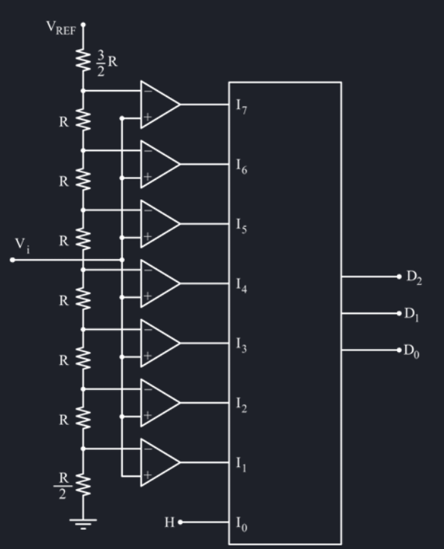

# Sistemi di conversione
I sistemi di conversione vengono usati per ottenere dei dati digitali a partire da dati analogici, o ottenere dati analogici a partire da dati digitali. In natura non esistono dati digitali, che però sono più facili da elaborare tramite un calcolatore, per cui sono molto più comuni i convertitori analogico / digitale.

Per passare da un segnale analogico ad uno digitale si effettuano due passaggi, **campionamento** e **quantizzazione**. Il primo suddivide il segnale analogico in tempo continuo in intervalli di tempo discreti (campionando ad esempio ogni 100 millisecondi), mentre il secondo prende il valore analogico e lo codifica tramite bit (ad esempio usando due bit per dividere 1V in 4 stati, ognuno da 0.25V, e rappresentando la tensione corrente con lo stato a cui si avvicina di più).

Uno degli aspetti a cui si deve fare più attenzione è la perdita di informazione durante la discretizzazione dell'informazione da analogica a digitale.
## Campionamento e aliasing
Il campionamento è il prodotto del segnale analogico per un treno di impulsi. Ogni impulso avviene dopo un tempo $T_c$ dal precedente, e il risultato è la discretizzazione nel tempo dell'informazione precedentemente continua.

Analizzando nel dominio della frequenza il segnale campionato si può notare come la banda principale si ripete ogni $f_C = \frac{1}{t_C}$. Per ricostruire il segnale campionato nel dominio della frequenza è necessario usare un filtro passa basso che elimina le bande secondarie, tuttavia per non avere fenomeni di aliasing si deve rispettare il teorema di Nyquist[^1] che afferma che detto $F_C$ la frequenza di campionamento e $F_A$ la frequenza fondamentale del segnale analogico:

$F_C \ge 2\cdot F_A$

Tuttavia, in un filtro passa-basso reale l'attenuazione non è infinita e quindi vi sarà sempre un minimo di **rumore di aliasing** residuo.

La conversione avviene tramite un modulo chiamato **sample hold**, che campiona il segnale in ingresso (sample) e lo mantiene stabile (hold) durante la conversione fino al campione successivo. Questa operazione introduce una distorsione che va corretta tramite il passa-basso.

[^1]: Teorema del campionamento

## Quantizzazione ed errore di quantizzazione
Un segnale analogico ha una risoluzione infinita, mentre un segnale digitale ha una risoluzione finita; con N bit, è possibile avere una risoluzione di 2^N stati, e lo scopo della quantizzazione è quello di associare ad ogni impulso del segnale campionato uno stato discreto.

La quantizzazione introduce un errore di quantizzazione $|\epsilon_q| \leq \frac{S}{2^{N + 1}}$, dove S è il massimo valore analogico. Se gli intervalli di quantizzazione sono uniformi si può semplificare in $|\epsilon_q| \leq \frac{1}{2}LSB$, dove LSB è l'ampiezza di ciascun intervallo.

La qualità del campionamento è indicata dal *signal-noise ratio* espresso come il rapporto tra la potenza di segnale e la potenza del rumore di quantizzazione $SNR_q = \frac{\sigma_A^2}{\sigma_{eq}^2}$, dove $\sigma_{eq}^2 = \frac{S^2}{12\cdot 2^{2N}}$.

Vi sono alcune relazioni note che esprimono $SNR_q$ per alcuni segnali particolari:

| Segnale | $SNR_q$ |
| - | - |
| Sinusoidale | $(6N + 1.76)$ dB |
| Triangolare | $6N$ dB |
| Voce[^2] | $(6N - 4.77)$ dB |

[^2]: Il segnale voce è un segnale con una distribuzione di potenza gaussiana.

La **precisione** effettiva deve tenere conto sia dell'errore di quantizzazione che del rumore di aliasing e si può esprimere tramite $SNR_{tot} = \frac{\sigma_S}{\Pi_i \sigma_i}$, ovvero il rapporto tra la potenza del segnale e la sommatoria delle potenze degli errori. Si può quindi ricavare il numero efficace di bit tramite il parametro ENOB[^3] pari a $ENOB = \frac{SNR_{tot} - 1.76}{6}$.

[^3]: Effective Number of Bits
## Convertitore D/A
Un convertitore DAC è un dispositivo che converte segnali digitali in segnali analogici. Questo componente ha una caratteristica lineare, e di conseguenza può soffrire di errori statici ed errori dinamici.

Prendendo un qualunque segnale campionato e quantizzato, ovvero un segnale digitale, si può convertire l'analogico interpolando linearmente i punti campionati (unisci i puntini), ricavando quindi una retta spezzata che approssima un segnale analogico.
### Errore di non-linearità
Questi errori **statici** riguardano il confronto la carattristica ideale e quella approssimata. Idealmente la caratteristica dovrebbe essere perfettamente ideale, ma nella realtà non è così semplice.

- L'errore di non-linearità **intergrale** $\epsilon_{nli}$ è il massimo scostamento tra la caratteristica reale e la retta approssimata.
- L'errore di non-linearità  **differenziale** $\epsilon_{nid}$ è lo scostamento locale tra la caratteristica reale e la retta approssimata $\epsilon_{nid} = A_D - A_D^{'}$. Se questo errore è maggiore di 1 LSB allora si ha anche errore di **non monotonicità**.

### Errore di linearità
Questi errori **statici** riguardano il confronto tra la retta approssimante la curva reale e la retta ideale.

- L'errore di **offset** $\epsilon_0$ rappresenta il valore della retta per $x = 0$, ovvero quanto la retta è shiftata verso l'alto.
- L'errore di **guadagno** $\epsilon_0$ rappresenta la differenza di pendenza tra la retta approssimata e quella ideale.
### Errori dinamici
Questi errori riguardano il comportamento durante la transizione di fase del segnale.

- **Tempo di assetto** ovvero il tempo impiegato dal convertitore DAC per portarsi al nuovo valore. Il transitorio si considera esaurito quando l'uscita inizia ad oscillare attorno al nuovo valore per un intervallo di $\pm 1$ LSB.
- **Glitch** avviene quando vi è una variazione sostanziale dell'uscita in un lasso di tempo molto piccolo.

### Circuito di conversione a grandezze uniformi

Questo circuito converte in base alla somma di variabili di peso uguale, con l'uscita che equivale quindi a $OUT = D \cdot LSB$.
Ad esempio, per $D = 9 = 1+1+1+1+1+1+1+1+1$, con peso $LSB = 2^0 = 1$ in ogni posizione.

Questo circuito si realizza tramite delle resistenze in parallelo con la stessa caratteristica resistiva.
L'uscita è comunemente in corrente piuttost che tensione.
### Circuito di conversione a grandezze pesate

Questo circuito utilizza dei pesi variabili in modo tale da poter realizzare la conversione, con $OUT = \Sigma 2^i \cdot D_i$.

Riutilizzando l'esempio del 9, si ha che $D = 9 = 0001001$ e i pesi sono $\begin{matrix}2^5&2^4&2^3&2^2&2^1&2^0\end{matrix}$, il risultato è $9_D = 1\cdot 2^3 + 1\cdot 2^0$.

In questo caso, le resistenze che formano il circuto sono a loro volta pesate.

Il problema di questo tipo di circuito è che ha una forte dinamica dei valori delle resistenze (resistenza massima pari a $2^{N-1}R$), per cui si può usare una rete a scala per ridurre la dinamica necessaria.

Questa rete a scala è facilmente espandibile ed usa solo resistenze di valore R e 2R, per cui è molto efficiente. La corrente di uscita finale prende il valore di $I_{OUT} = \sum\limits_{i=0} \frac{I}{2^i}$ $= I + \frac{I}{2} + ... + \frac{I}{2^{N - 1}}$.

Questo circuito può portare errori non indifferenti sui rami più profondi. Infatti, maggiore è la profondità di un ramo, maggiore è l'incertezza sulla resistenza totale, e quindi si creano errori di non linearità per gli MSB. 

## Convertitore A/D
Un convertitore ADC è un dispositivo che converte un segnale analogico in digitale. Questo dispositivo dovrebbe essere idealmente rapido e poco complesso, tuttavia questi due parametri sono inversamente proporzionali, per cui minore è il tempo di conversione, maggiore è la complessità.

### Convertitore ADC Flash Parallelo

Questo è uno dei convertitori più veloci in assoluto, è formato da $2^{N - 1}$ comparatori che in uscita producono uno 0 o un 1 in base alla soglia. Richiede un solo ciclo di clock per convertire N bit, in quanto tutti i comparatori operano in parallelo. 

### Convertitore ad inseguimento
Questo circuito, per ogni ciclo di clock, confronta il segnale in ingresso con il segnale approssimato, per cui detto il loro rapporto $R_A = \frac{A}{A^{'}}$:

- Se $R_A < 1$ il contatore viene incrementato di 1 LSB;
- Se $R_A < 1$ il contatore viene decrementato di 1 LSB; 

Si procede così finché non viene raggiunta la migliore approssimazione di A.

Questo tipo di convertitore è molto lento in quanto nel caso peggiore servono $2^N$ cicli per convertire N bit, ma è anche molto semplice poiché basta un solo comparatore per realizzarlo.
### Convertitore ad approssimazioni successive
Questo circuito, per ogni ciclo di clock, tiene in consideranzione MSB ed LSB per realizzare una soglia, dopo di ché confronta l'ingresso con questa soglia[^4].

- Se A si trova nella parte superiore della soglia, il bit viene impostato ad 1 e l'LSB viene incrementato fino alla soglia;
- Se A si trova nella parte inferiore della soglia, il bit viene impostato a 0 e il MSB viene decrementato fino alla soglia;

[^4]: Un buon paragone è quello della ricerca dicotomica.

Non è rapidissimo, ma nel caso peggiore servono solo N cicli per convertire N bit, inoltre è semplice in quanto occorre solamente un comparatore.