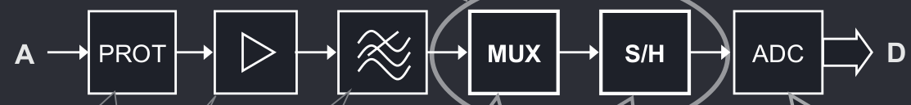
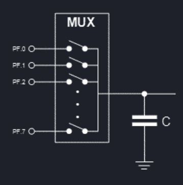
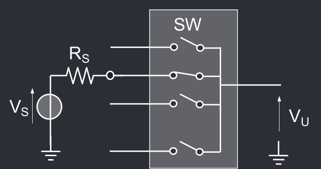
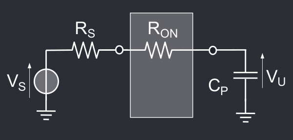
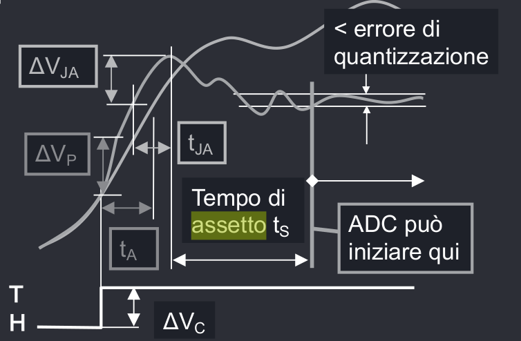
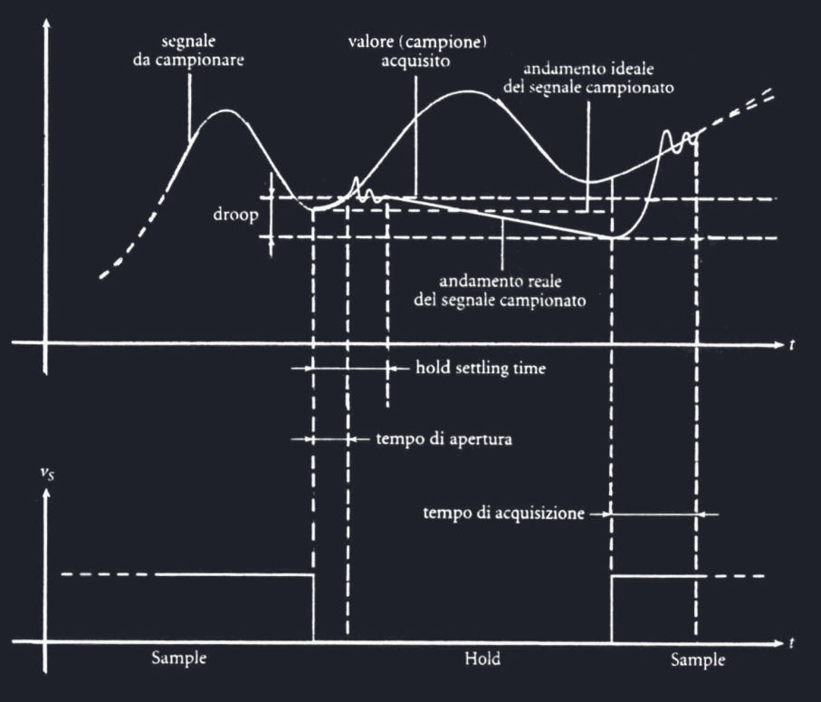

# Multiplexer e Sample Hold
Multiplexer e Sample-Hold sono l'ultimo passo a valle del circuito di conversione, prima dell'effettivo ADC.

## Multiplexer
Il multiplexer è un banco di interruttori realizzati tramite dei transistori MOS che permettono di selezionare un singolo ingresso tra N, e collegarlo all'uscita.

In un multiplexer ideale, l'unico canale in cui passa segnale è quello selezionato, tuttavia un multiplexer reale soffre di diversi errori di non linearità.

L'interruttore chiuso ha una resistenza equivalente $R_{ON}$, che forma quindi un partitore con $R_S$, $R_{ON}$ e la resistenza del carico $R_L$, dunque vi è dell'attenuazione del segnale.

Inoltre le uscite aperte hanno comunque delle correnti di perdita $I_{OFF}$ che percorrono $R_L // (R_{ON} + R_S$, generando una $V_{OFF}$ in uscita.

Infine, le capacità parassite del carico e del multiplexer limitano la banda che può passare attraverso il multiplexer e generano un errore di offset.
## Sample Hold
Il circuito di Sample-Hold è il circuito più a valle possibile. Si occupa di campionare un ingresso che varia costantemente nel tempo e mantenere l'uscita per un tempo $t \ge t_H$.

La prima parte del Sample-Hold è un circuito di amplificazione unitario, in quanto l'uscita dev'essere pari all'ingresso.

In un SH ideale, il campionamento istantaneo avviene in un tempo infinitesimo, tuttavia in un SH reale si ha :

- un **tempo di apertura**, ovvero il tempo che intercorre tra la ricezione del comando di sample e l'apertura dell'interruttore 
- un **tempo di assetto**, ovvero il tempo che impiega il segnale ad assestarsi su suo valore reale. Questo perché quando viene chiuso il circuito di ricezione del segnale, il passaggio da alta impedenza a circuito chiuso fa rialzare il segnale più del dovuto per un fenomeno detto **Jitter** di campionamento.

Come in precedenza, essendo il Jitter un rumore si può valutare il **Signal-To-Noise-Ratio** come $SNR_J = \frac{\sigma_A^2}{\sigma_J^2}$.

Una volta catturato il segnale, questo è prono a fenomeni di **decadimento**, ovvero diminuzione del segnale nel tempo e **feedthrough**, se l'ingresso è schermato male e quindi una minima parte delle variazioni va ad influire sull'uscita.

