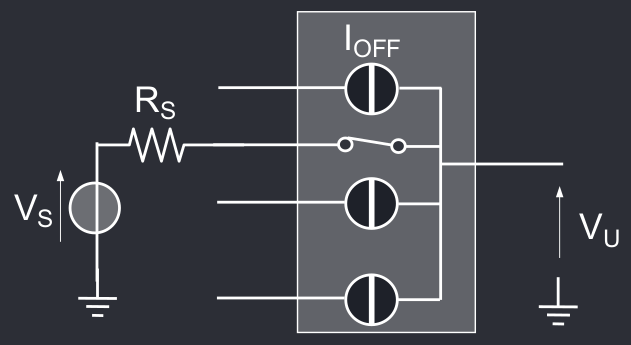

# Multiplexer e Sample Hold
Multiplexer e Sample-Hold sono l'ultimo passo a valle del circuito di conversione, prima dell'effettivo ADC.

## Multiplexer
Il multiplexer è un banco di interruttori realizzati tramite dei transistori MOS che permettono di selezionare un singolo ingresso tra N, e collegarlo all'uscita.

In un multiplexer ideale, l'unico canale in cui passa segnale è quello selezionato, tuttavia un multiplexer reale soffre di diversi errori di non linearità.

L'interruttore chiuso ha una resistenza equivalente $R_{ON}$, che forma quindi un partitore con $R_S$, $R_{ON}$ e la resistenza del carico $R_L$, dunque vi è dell'attenuazione del segnale.

Inoltre le uscite aperte hanno comunque delle correnti di perdita $I_{OFF}$ che percorrono $R_L // (R_{ON} + R_S$, generando una $V_{OFF}$ in uscita.

Infine, le capacità parassite del carico e del multiplexer limitano la banda che può passare attraverso il multiplexer e generano un errore di offset.
## Sample Hold