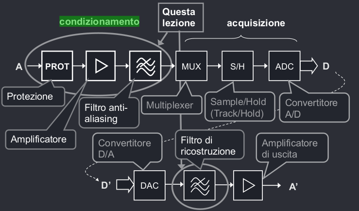

# Condizionamento del segnale

## Circuiti di protezione
I segnali che vengono dall'esterno sono soggetti a rumori e intereferenze che potrebbero generare picchi di tensione e/o corrente che danneggerebbero i componenti interni del convertitore, per cui si usano dei dispositivi che limitano la dinamica di tensione in ingresso. 

Questo si può fare tramite clamp a diodi, diodi zener, e altri componenti particolari.
## Filtri anti-aliasing
I filtri di anti-aliasing vengono usati prima del campionamento del segnale per restringere la banda del segnale secondo il teorema di campionamento di Nyquist. Dati la frequenza di banda del filtro $f_B$ e la frequenza di campionamento $f_C$, e ricordando che se $t_C < t_B$ allora $f_C > f_B$, il filtro:

- Non deve attenuare fino a $f_B$
- Tra $f_B$ e $f_C$ deve attenuare di almeno $SNR_A$, ovvero il signal to noise ratio, rendendo il segnale tra $f_B$ e $f_C$ piccolo abbastanza per essere scambiato per del rumore.

Nel range tra $f_B$ ed $f_C$ la dinamica è di $G = $\frac{f_S - f_B}{f_B}$, e ogni polo presente attenua di $A_P = 20\cdot log_{10}\frac{f_S - f_B}{f_B}$ dB.

Si può trovare il numero di poli necessari per progettare il filtro come $\#P = \frac{SNR_A}{A_P}$.
## Errore totale e SNR
Il Signal-To-Noise-Ratio totale dipende complessivamente da tutti gli errori, ovvero: **errore di quantizzazione**, **rumore di aliasing**, **errore di Jitter**, e altri errori della catena di condizionamento e si può trovare come $SNR_T = 10\cdot log_{10}\frac{1}{\Sigma A_i}$.