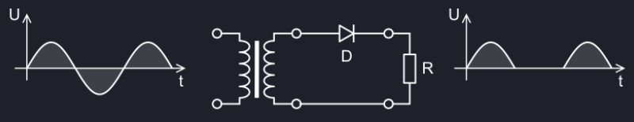
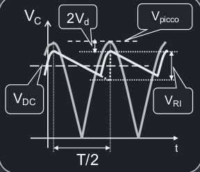
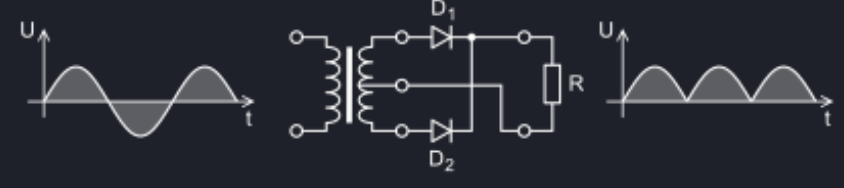
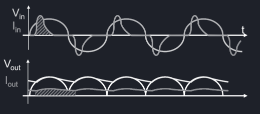

# Circuiti di potenza
## Raddrizzatore
Il **raddrizzatore** è un circuito che trasforma la corrente alternata in corrente continua.
### Raddrizzatore a singola semionda
In questo raddrizzatore, al segnale in ingresso in alternata viene rimossa la semionda negativa, lasciando soltanto la semionda positiva. Questo avviene portando il segnale a 0 per tutto il periodo della semionda negativa.

Il segnale di uscita $V_{OUT}$ è quindi un segnale SEGA.

Vi sono quattro parametri fondamentali da analizzare:

- Tensione di **ripple**, ovvero l'ampiezza dell'ondulazione della sega $V_{ri} = \frac{I_O}{f_C}$
- Tensione di **picco**, ovvero l'ampiezza massima del segnale $V_{pi} =  V_{in} - V_d$ dove $V_d$ equivale alla caduta di tenzione su un singolo diodo.
- Valore **medio** $V_m = \frac{V_{pi}}{\pi}$
- Valore **efficacie** $V_{eff} = \frac{V_{pi}}{2}$

### Raddrizzatore a semionda intera
In questo raddrizzatore, la semionda negativa viene capovolta in una semionda positiva.

Un segnale in continua ideale ha una variazione minima, e questo tipo di raddrizzatore è molto più efficace di quello a singola semionda, in quanto ha un ripple dimezzato, tuttavia anche il picco massimo è minore.

- Tensione di **ripple**, ovvero l'ampiezza dell'ondulazione della sega $V_{ri} = \frac{I_O}{2\cdot f_C}$
- Tensione di **picco**, ovvero l'ampiezza massima del segnale $V_{pi} =  V_{in} - 2\cdot V_d$ dove $V_d$ equivale alla caduta di tenzione su un singolo diodo.
- Valore **medio** $V_m = \frac{2\cdot V_{pi}}{\pi}$
- Valore **efficacie** $V_{eff} = \frac{V_{pi}}{\sqrt{2}}$

## Regolatori
Un regolatore è un dispositivo usato per mantenere una tensione di uscita stabile a prescindere dalle variazioni di della tensione di ingresso. Questo dispositivo è molto utile per i circuiti che richiedono una corrente continua stabile.

La modalità di funzionamento generica è quella di mantenere la tensione di uscita costante tramite la dissipazione del surplus di energia sotto forma di calore.
### Regolatori lineari (in serie)
Questo tipo di dispositivo viene posto in serie al carico per offrire una resistenza variabile (tipicamente tramite un transistor) il cui valore viene costantemente regolato da una **retroazione negativa**.

Questo induce a una caduta di tensione e a correnti di perdita che riducono l'efficacia del regolatore, che si calcola come $\eta = \frac{V_{OUT}}{V_{IN}}$.
### Regolatori a commutazione
I regolatori a commutazione sono molto più efficienti dei regolatori lineari, in quanto invece di dissipare l'energia superflua, la conservano e riutilizzano.

L'elemento principale di questo regolatore è l'interruttore, che controlla il flusso di energia. Quando è acceso vi è piena potenza, mentre quando è spento non vi è alcun passaggio di energia, o almeno idealmente. Nella realtà vi sono correnti di perdita $I_l$.

Il rendimento dei regolatori a commutazione dipende dal tipo di regolatore e varia tra lo 0.8 e 0.9.

- Per regolatori **buck** $\eta = D$
- Per regolatori **boost** $\eta = \frac{1}{1 - D}$
- Per regolatori **buck-boost** $\eta = \frac{D}{1 - D}$

Dove D è il duty cycle dell'onda quadra che viene usata per gestire la commutazione di energia.