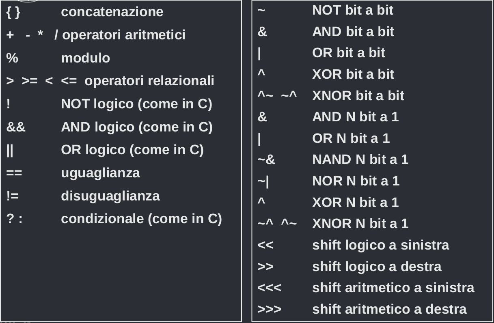

# Verilog
Verilog è uno dei principali linguaggi di modellazione hardware.

Permette di modellare a tre livelli di astrazione:

- Funzionale
- Register Transfer Level
- Porte logiche

e si può usare per simulare, sintetizzare e verificare la correttezza dei sistemi elettronici.

## Comandi con esempio

```verilog
module Processor(Clock, Reset, RW, Data, Address);
    input Clock;
    input Reset;
    output RW;
    inout [15:0] Data;
    output [19:0] Address;
    ...
endmodule
```
L'istruzione `module Name(*kargs)` viene usata per definire un modulo digitale, e gli argomenti dell'istruzione sono tutte le porte che devono comunicare con l'esterno.

All'interno del modulo si usano i comandi `input` e `output` per definire se le porte sono di ingresso o uscita, `inout` per le porte bidirezionali, e se le porte sono multi-bit si usa `[indiceBitIniziale:indiceBitFinale]`, quindi per un segnale a 20 bit semplice si può usare `[19:0]`.

## Modello a livello di porte logiche


```verilog
module my_nand(OUT0, IN0, IN1);
    output OUT0;
    input IN0;
    input IN1;
    wire X;
    and (X, IN0, IN1);
    not (OUT0, X);
endmodule
```
Si possono usare i comuni moduli di algebra booleana `and`, `or`, `not`, `xor`, `nand`, `nor`, etc... e la loro sintassi è `modulo (OUTPUT1, ..., OUTPUTN, INPUT1, ..., INPUTM)`. Si definiscono le interconnessioni interne tra i moduli con il comando `wire`.
### Esempio di sommatore a quattro bit
```verilog


module add4(s, co, ci, a, b);
    input [3:0] a,b;
    input ci;
    output [3:0] s;
    output co;
    wire [2:0] c;
        fadd a0(s[0], co[0], a[0], b[0], ci);
        fadd a1(s[1], c[1], a[1], b[1], c[0]);
        fadd a2(s[2], c[2], a[2], b[2], c[1]);
        fadd a3(s[3], c[3], a[3], b[3], c[2]);
endmodule
```

Dove `fadd` è un full adder già modellato con `output s,co; input a,b,ci;`.
### Esempio di porta xor con ritardo
```verilog
module my_xor(C, A, B);
    output C;
    input A;
    input B;
    assign #2 C = (A ^ B);
endmodule
```

L'istruzione `assign` viene usata per assegnare ad una variabile il risultato di un'operazione logica. Si usa `#N` per assegnare un delay all'operazione di N unità temporali dopo il cambiamento di A e B.

I ritardi hanno significato solo per la simulazione, non servono per la sintesi.

| Operation | Operator |
| - | - |
| ~ | Bitwise NOR |
| & | Bitwise AND |
| \| | Bitwise OR |
| ^ | Bitwise XOR |

### Esempio sommatore ad N bit
```verilog
module Adder(cout, sum, a, b, cin);
    parameter width = 2;
    input cin;
    input [width-1:0] a, b;
    output [width-1:0] sum;
    assign {cout, sum} = a + b + cin;
endmodule
```
Si può usare l'istruzione `parameter` per creare un parametro costante che si può modificare a freddo per cambiare il comportamento del sistema.
### Operatori

### Tipi di segnali
Verilog permette di definire sia segnali senza memoria tramite `wire`, che segnali con memoria che ricordano l'ultimo valore assegnato tramite `reg`.
### Sommatore a quattro bit con cicli for ed if
```verilog
module add4 (s, cout, ci, a, b);
    input [3:0] a, b;
    input ci;
    output [3:0] s;
    output cout;
    wire [2:0] co;
    genvar i;
    generate for (i = 0; i < 4; i = i + 1) begin
        if (i == 0)         fadd(co[0], s[0], a[0], b[0], ci);
        else if (i == 3)    fadd(cout, s[3], a[3], b[3], co[2]);
        else                fadd(co[i], s[i], a[i], b[i], co[i - 1]);
        end 
    endgenerate
endmodule
```